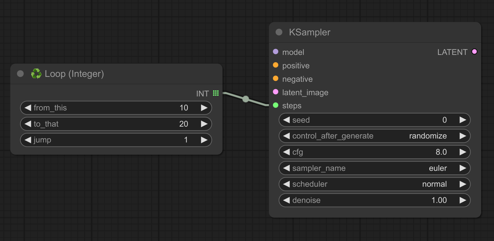
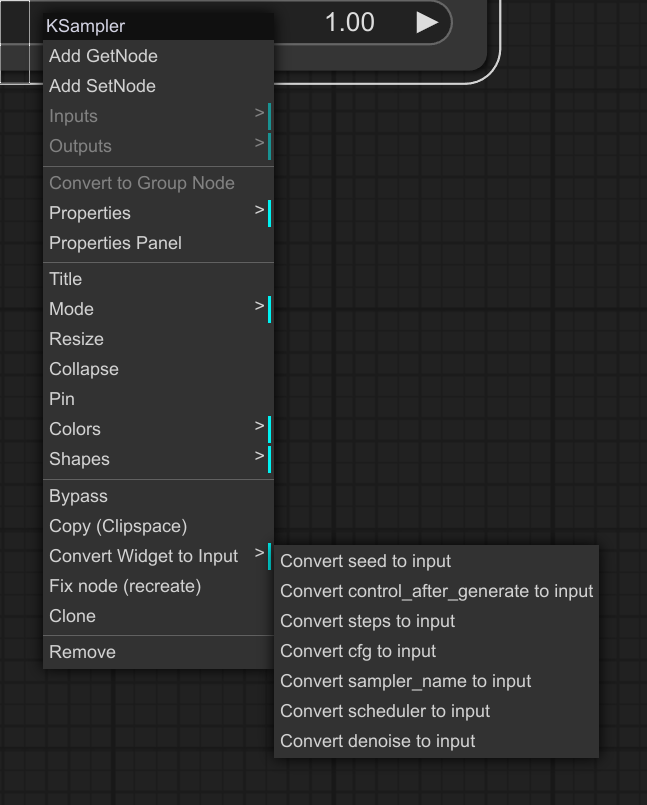
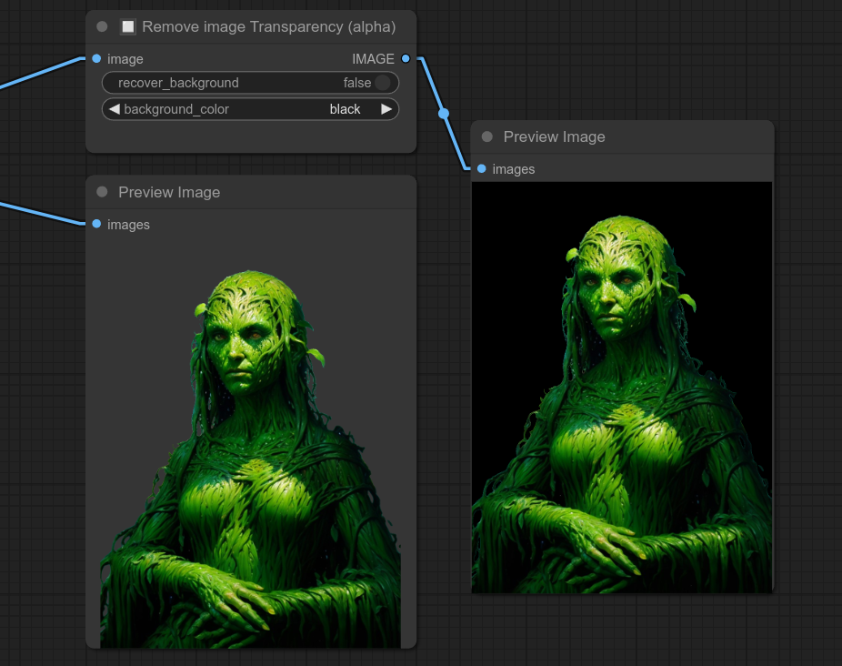
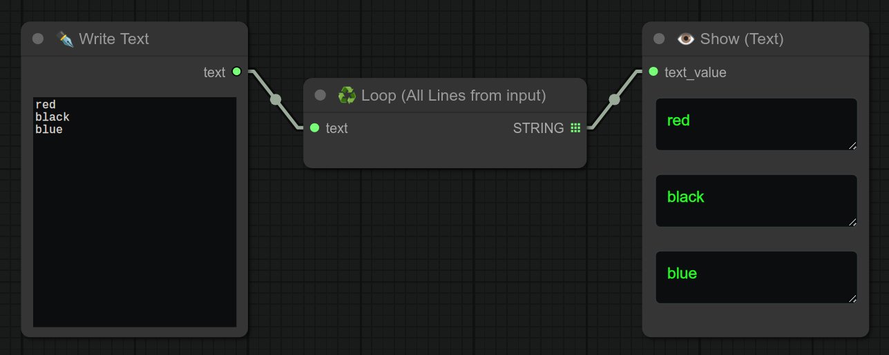
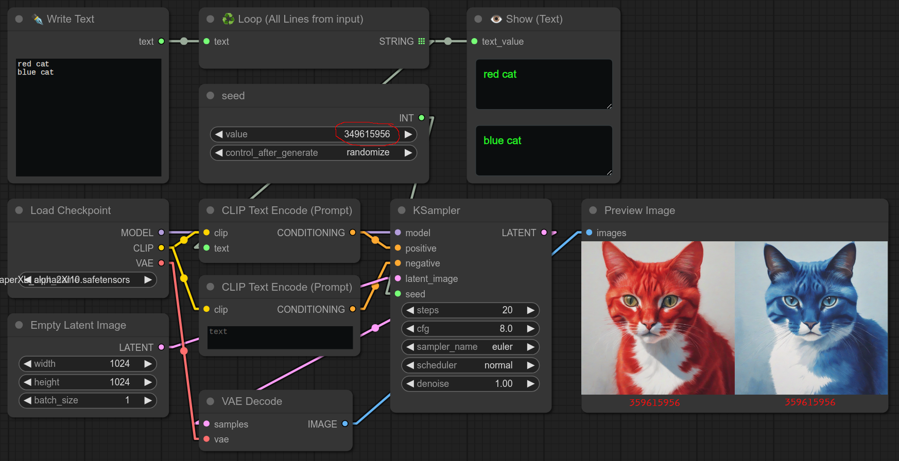
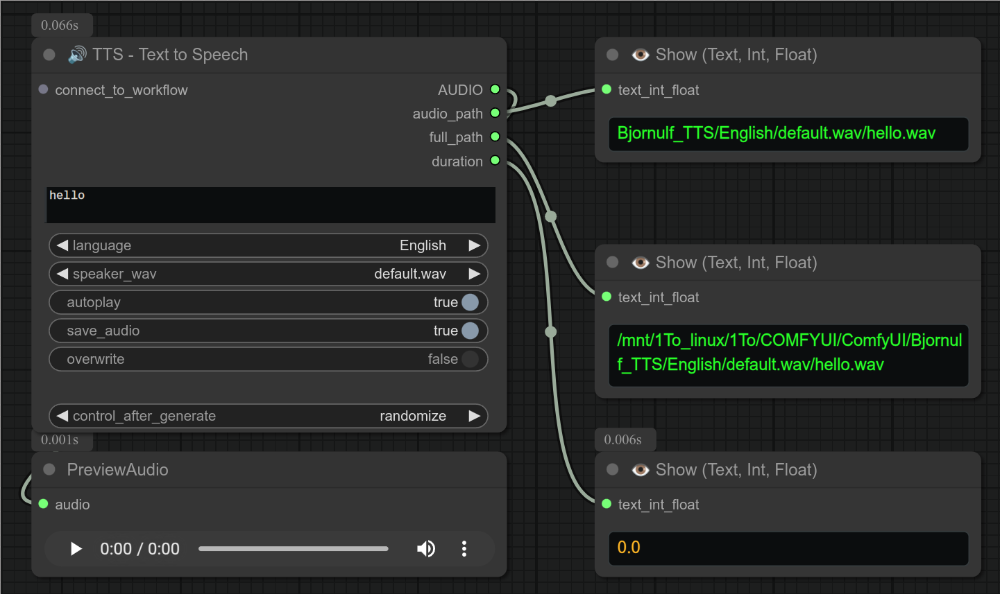
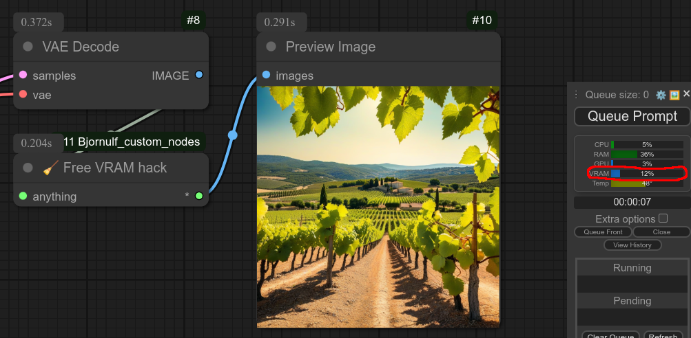

# 🔗 Comfyui : Bjornulf_custom_nodes v0.18 🔗

# Dependencies

- `pip install ollama` (you can also install ollama if you want :  https://ollama.com/download) - You don't need to really install it if you don't want to use my ollama node. (BUT you need to run `pip install ollama`)
- `pip install pydub` (for TTS node)

# 📝 Changelog

- **v0.2**: Improve ollama node with system prompt + model selection.
- **v0.3**: Add a new node : Save image to a chosen folder.
- **v0.3**: Add comfyui Metadata / workflow to all my image-related nodes.
- **v0.4**: Support transparency option with webm format, options encoders. As well as input for audio stream. 
- **v0.5**: New node : Remove image transparency (alpha) - Fill alpha channel with solid color.
- **v0.5**: New node : Image to grayscale (black & white) - Convert an image to grayscale.
- **v0.6**: New node : Combine images (Background + Overlay) - Combine two images into a single image.
- **v0.7**: Replace Save API node with Save Bjornulf Lobechat node. (For my custom lobe-chat)
- **v0.8**: Combine images : add an option to put image top, bottom or center.
- **v0.8**: Combine texts : add option for slashes /
- **v0.8**: Add basic node to transform greenscreen in to transparency.
- **v0.9**: Add a new node : Return one random line from input.
- **v0.10**: Add a new node : Loop (All Lines from input) - Iterate over all lines from an input text.
- **v0.11**: Add a new node : Text with random Seed - Generate a random seed, along with text.
- **v0.12**: Combine images : Add option to move vertically and horizontally. (from -50% to 150%)
- **v0.13**: Add a new node: Load image with transparency (alpha) - Load an image with transparency.
- **v0.14**: Add a new node: Cut image from a mask
- **v0.15**: Add two new nodes: TTS - Text to Speech and Character Description Generator
- **v0.16**: Big changes on Character Description Generator
- **v0.17**: New loop node, combine by lines.
- **v0.18**: New loop node, Free VRAM hack

# 📝 Nodes descriptions

## 1/2 - 👁 + ✒ Show/Write Text 

**Description:**  
Two simple nodes to write and show text.
Write node is a textarea where you can write your text.  
The show text node will only display the text. (That's why I made it a different color : green, uneditable, display only.)

## 3 - 🔗 Combine Texts

**Description:**  
Combine multiple text inputs into a single output. (can have separation with : comma, space, new line.)

## 4 - 🎲 Random Text

**Description:**  
Generate and display random text from a predefined list. Great for creating random prompts.

## 5 - ♻ Loop

**Description:**  
General-purpose loop node.

## 6 - ♻ Loop Texts

**Description:**  
Cycle through a list of text inputs. Great for creating dynamic text-based presentations.

## 7 - ♻ Loop Integer

**Description:**  
Iterate through a range of integer values, good for `steps` in ksampler, etc...

❗ Don't forget that you can convert ksampler widgets to input by right-clicking the ksampler node :

## 8 - ♻ Loop Float

**Description:**  
Loop through a range of floating-point numbers, good for `cfg`, `denoise`, etc...

## 10 - ♻ Loop All Samplers

**Description:**  
Iterate over all available samplers to apply them sequentially. Ideal for testing.

## 11 - ♻ Loop All Schedulers

**Description:**  
Iterate over all available schedulers to apply them sequentially. Ideal for testing.

## 12 - ♻ Loop Combos

**Description:**  
Generate a loop from a list of my own custom combinations (scheduler+sampler), or select one combo manually.  
Good for testing.

## 13/14 - 📏 + 🖼 Resize and Save Exact name ⚠️💣

**Description:**  
Resize an image to exact dimensions. The other node will save the image to the exact path.  
⚠️💣 Warning : The image will be overwritten if it already exists.

## 15 - 💾 Save Text

**Description:**  
Save the given text input to a file. Useful for logging and storing text data.

## 16 - 🖼💬 Save image for Bjornulf LobeChat (❗For my custom [lobe-chat](https://github.com/justUmen/Bjornulf_lobe-chat)❗)

**Description:**  
❓ I made that node for my custom lobe-chat to send+receive images from Comfyui API : [lobe-chat](https://github.com/justUmen/Bjornulf_lobe-chat)  
It will save the image in the folder `output/BJORNULF_LOBECHAT/`. 
The name will start at `api_00001.png`, then `api_00002.png`, etc...  
It will also create a link to the last generated image at the location `output/BJORNULF_API_LAST_IMAGE.png`.  
This link will be used by my custom lobe-chat to copy the image inside the lobe-chat project.  

## 17 - 🖼 Save image as `tmp_api.png` Temporary API ⚠️💣

**Description:**  
Save image for short-term use : ./output/tmp_api.png ⚠️💣  

## 18 - 🖼📁 Save image to a chosen folder name

**Description:**  
Save image in a specific folder : `my_folder/00001.png`, `my_folder/00002.png`, etc...  
Also allow multiple nested folders, like for example : `animal/dog/small`.

## 19 - 🦙 Ollama

**Description:**  
Will generate detailed text based of what you give it.  
I recommend using `mistral-nemo` if you can run it, but it's up to you. (Might have to tweak the system prompt a bit)  
⚠️ Warning : Having an ollama node that will run for each generation might be a bit heavy on your VRAM. Think about if you really need it or not.

**Description:**  
Straight forward node to write and show text.

## 20 - 📹 Video Ping Pong

**Description:**  
Create a ping-pong effect from a list of images (from a video) by reversing the playback direction when reaching the last frame. Good for an "infinity loop" effect.

## 21 - 📹 Images to Video

**Description:**  
Combine a sequence of images into a video file.  
❓ I made this node because it supports transparency with webm format. (Needed for rembg)  
Temporary images are stored in the folder `ComfyUI/temp_images_imgs2video/` as well as the wav audio file.

## 22 - 🔲 Remove image Transparency (alpha)

**Description:**  
Remove transparency from an image by filling the alpha channel with a solid color. (black, white or greenscreen)  
Of course it takes in an image with transparency, like from rembg nodes.  
Necessary for some nodes that don't support transparency.  

## 23 - 🔲 Image to grayscale (black & white)

**Description:**  
Convert an image to grayscale (black & white)  
Example : I sometimes use it with Ipadapter to disable color influence.  
But you can sometimes also want a black and white image... 

## 24 - 🖼+🖼 Combine images (Background + Overlay)

**Description:**  
Combine two images into a single image : a background and one (or several) transparent overlay. (allow to have a video there, just send all the frames and recombine them after.)  
Update 0.11 : Add option to move vertically and horizontally. (from -50% to 150%)  
❗ Warning : For now, `background` is a static image. (I will allow video there later too.)  
⚠️ Warning : If you want to directly load the image with transparency, use my node `🖼 Load Image with Transparency ▢` instead of the `Load Image` node.  

## 25 - 🟩➜▢ Green Screen to Transparency

**Description:**  
Transform greenscreen into transparency.  
Need clean greenscreen ofc. (Can adjust threshold but very basic node.)

## 26 - 🎲 Random line from input

**Description:**  
Take a random line from an input text. (When using multiple "Write Text" nodes is annoying for example, you can use that and just copy/paste a list from outside.)

## 27 - ♻ Loop (All Lines from input)

**Description:**  
Iterate over all lines from an input text. (Good for testing multiple lines of text.)

## 28 - 🔢 Text with random Seed

**Description:**  

❗ This node is used to force to generate a random seed, along with text.  
But what does that mean ???  
When you use a loop (♻), the loop will use the same seed for each iteration. (That is the point, it will keep the same seed to compare results.)  
Even with `randomize` for `control_after_generate`, it is still using the same seed for every loop, it will change it only when the workflow is done.  
Simple example without using random seed node : (Both images have different prompt, but same seed)  

So if you want to force using another seed for each iteration, you can use this node in the middle.
For example, if you want to generate a different image every time. (aka : You use loop nodes not to compare or test results but to generate multiple images.)  
Use it like that for example : (Both images have different prompt AND different seed)  

Here is an example of the similarities that you want to avoid with FLUX with different prompt (hood/helmet) but same seed :

Here is an example of the similarities that you want to avoid with SDXL with different prompt (blue/red) but same seed :

FLUX : Here is an example of 4 images without Random Seed node on the left, and on the right 4 images with Random Seed node :

## 29 - 🖼 Load Image with Transparency ▢

**Description:**  
Load an image with transparency.  
The default `Load Image` node will not load the transparency.  

## 30 - 🖼✂ Cut image with a mask

**Description:**  
Cut an image from a mask.  

## 31 - 🔊 TTS - Text to Speech

**Description:**  
Use my TTS server to generate speech from text.  
❗ Of course you need to use my TTS server : <https://github.com/justUmen/Bjornulf_XTTS>  
After having that installed, you NEED to create a link in my Comfyui custom node folder called `speakers` : `ComfyUI/custom_nodes/Bjornulf_custom_nodes/speakers`  
That link must must be a link to the folder where you store the voice samples you use for my TTS, like `default.wav`.  
If my TTS server is running on port 8020 (You can test in browser with the link <http://localhost:8020/tts_stream?language=en&speaker_wav=default&text=Hello>) and voice samples are good, you can use this node to generate speech from text.  

### 32 - 🧑📝 Character Description Generator

**Description:**  
Generate a character description based on a json file in the folder `characters` : `ComfyUI/custom_nodes/Bjornulf_custom_nodes/characters`  
Make your own json file with your own characters, and use this node to generate a description.  
❗ For now it's very basic node, a lot of things are going to be added and changed !!!  
Some details are unusable for some checkpoints, very much a work in progress, the json structure isn't set in stone either.  

### 33 - ♻ Loop (All Lines from input 🔗 combine by lines)

**Description:**  
Sometimes you want to loop over several inputs but you also want to separate different lines of your output.  
So with this node, you can have the number of inputs and outputs you want. See example for usage.  

### 34 - 🧹 Free VRAM hack

**Description:**  
So this is my attempt at freeing up VRAM after usage, I will try to improve that.  
For me, on launch ComfyUI is using 180MB of VRAM, after my clean up VRAM node it can go back down to 376MB.  
I don't think there is a clean way to do that, so I'm using a hacky way.  
So, not perfect but better than being stuck at 6GB of VRAM used if I know I won't be using it again...  
Just connect this node with your workflow, it takes an image as input and return the same image without any changes.  
❗ Comfyui is using cache to run faster (like not reloading checkpoints), so only use this free VRAM node when you need it.  